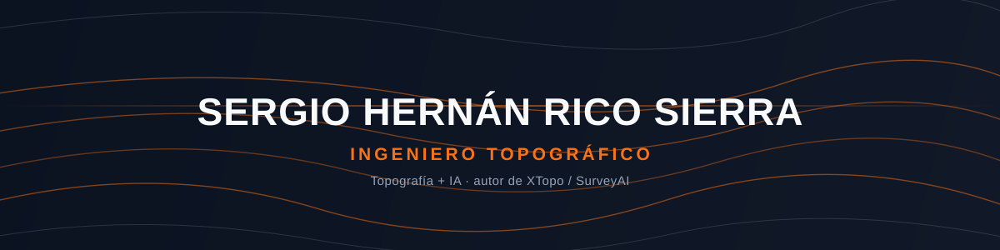

<picture>
  <source media="(prefers-color-scheme: dark)"  srcset="assets/banner-dark.svg">
  <source media="(prefers-color-scheme: light)" srcset="assets/banner-light.svg">
  
</picture>

 

  

&nbsp;&nbsp;
&nbsp;&nbsp;

 

---

## Sobre mí

Soy **Ingeniero Topográfico**, de Colombia 🇨🇴. Trabajo en el punto donde la topografía
tradicional se encuentra con el software y la inteligencia artificial.

- 🗺️ Construyo **[XTopo / SurveyAI](https://www.xtopo.com.co)**, una plataforma web gratuita
  con herramientas de topografía, geodesia y GNSS para el trabajo de campo y de oficina en
  Colombia: procesamiento PPP, editor DWG/DXF propio, nubes de puntos, diseño geométrico de
  vías, cálculos GNSS y más.
- 🤖 La combino con **IA aplicada a la geomática**: asistentes que leen normas técnicas,
  automatizan cálculos y aceleran el trabajo de campo a oficina.
- 🎓 Nace como mi trabajo de grado, y hoy es una herramienta que uso — y que otros
  topógrafos ya están usando — en obra real.
- 💬 Escríbeme si te interesa la topografía digital, el GNSS/PPP o construir producto con IA.

 

## Stack

---

## Proyecto destacado

<table>
<tr><td>

### 🗺️ [XTopo — SurveyAI](https://www.xtopo.com.co)

Plataforma web gratuita de topografía asistida por IA para Colombia: cálculos GNSS y PPP,
editor propio de DWG/DXF (lectura, edición y guardado en el navegador, sin AutoCAD),
visor de nubes de puntos, diseño geométrico de vías, memorias de linderos y un asistente
de IA que responde con base en las normas técnicas del sector.

</td></tr>
</table>

---

## Números

---

Hecho con topografía, café y mucho TypeScript · <a href="https://www.xtopo.com.co">xtopo.com.co</a>

